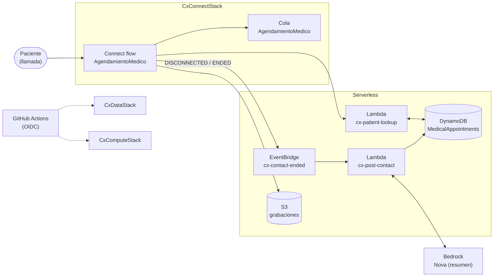

# Demo-CX — Agendamiento de citas médicas (Amazon Connect + Serverless)

Demostracion de uso de Amazon Connect con componentes Serverless (como Lambdas) enfocado en experiencia del cliente (CX) para agendamiento de citas medicas.

## Arquitectura



## Estructura

```
  _____
./ cx /
├── cdk/                          # Infraestructura como código (CDK TypeScript)
│   ├── bin/cx.ts                 # App: CxConnectStack + CxDataStack + CxComputeStack
│   ├── lib/
│   │   ├── connect-stack.ts      # Telefonía: horario, cola, flow, routing
│   │   ├── data-stack.ts         # Datos: DynamoDB + S3 grabaciones
│   │   └── compute-stack.ts      # Cómputo: Lambdas + EventBridge + Bedrock
│   ├── contact-flows/            # Flows versionados (JSON exportado de consola)
│   │   └── agendamiento-v1.json
│   ├── test/cx.test.ts           # Tests de synth (sin VPC, sin acoples)
│   ├── cdk.json                  # App + feature flags (el CLI se ejecuta desde aquí)
│   └── cdk.out/                  # Output generado del synth (ignorado en git)
├── srv/                          # Componentes Serverless (srv): Código de funciones Lambda
│   ├── patient-lookup/index.ts   # Invocada desde el flow (lookup en DynamoDB)
│   └── post-contact/index.ts     # EventBridge → persiste interacción + resumen Bedrock
├── .github/workflows/            # CI/CD (OIDC, solo stacks serverless)
├── scripts/smoke.mjs             # Smoke test post-despliegue (Node nativo, contra AWS real)
├── package.json / tsconfig.json / jest.config.js   # Toolchain compartida (raíz)
└── README.md
```

## Separación Connect / Serverless

| App | Stacks | Despliegue |
|-----|--------|------------|
| Telefonía | `CxConnectStack` (instancia opcional, horario, cola, flow, routing) | `npm run deploy:connect` o con instancia existente: `npx cdk deploy CxConnectStack -c connectInstanceArn=arn:...` |
| Serverless | `CxDataStack` (DynamoDB + S3) + `CxComputeStack` (2 Lambdas + EventBridge + Bedrock) | `npm run deploy:serverless:dev` |

Los stacks serverless **no referencian** al stack Connect: el vínculo
flow ↔ Lambda se configura pegando el ARN de `cx-patient-lookup` en el
bloque Invoke del flow. Así el backend itera sin tocar telefonía.

**Sin VPC por diseño.** DynamoDB, S3, Bedrock y EventBridge se consumen por
endpoints públicos con IAM de mínimo privilegio.

## Requisitos

Node >= 22, AWS CLI v2, `us-east-1`, créditos controlados (números locales).

## Uso local

```bash
npm ci
npm run build      # tsc --noEmit
npm test           # jest (synth de los 3 stacks)
npm run synth      # o synth:connect / synth:serverless
```

## Flujo de trabajo sugerido

1. Consola: crear instancia `cx-medica`, reclamar número, crear usuario de prueba.
2. `npm run deploy:serverless:dev` (serverless primero).
3. Pegar el ARN de `cx-patient-lookup` en `cdk/contact-flows/agendamiento-v1.json`
   (campo `LambdaFunctionARN`) y en el flow de consola; exportar el JSON final
   de vuelta a `cdk/contact-flows/`.
4. `npm run deploy:connect -- -c connectInstanceArn=<arn>` para versionar
   horario/cola/flow/routing (el CLI de CDK se ejecuta desde `cdk/`).
5. Llamada de prueba → verificar atributos (`describe-contact`) e ítem
   `INTERACTION#<contactId>` en DynamoDB → resumen Bedrock Nova.

## Despliegue continuo (GitHub Actions + OIDC)

El workflow [`.github/workflows/deploy.yml`](.github/workflows/deploy.yml) despliega
solo los stacks serverless (`CxDataStack` + `CxComputeStack`) en cada push a `main`,
asumiendo un rol IAM vía OIDC (sin claves de acceso largas). Configuración inicial
con AWS CLI (una vez por cuenta):

```bash
export AWS_REGION=us-east-1
export ACCOUNT_ID=$(aws sts get-caller-identity --query Account --output text)

# 1. Proveedor OIDC de GitHub (una vez por cuenta; si ya existe, da error y se ignora)
aws iam create-open-id-connect-provider \
  --url https://token.actions.githubusercontent.com \
  --client-id-list sts.amazonaws.com \
  --thumbprint-list 6938fd4d98bab03faadb97b34396831e3780aea1

# 2. Política de confianza: el rol solo puede ser asumido por este repo
cat > trust.json <<'EOF'
{
  "Version": "2012-10-17",
  "Statement": [{
    "Effect": "Allow",
    "Principal": {"Federated": "arn:aws:iam::<ACCOUNT_ID>:oidc-provider/token.actions.githubusercontent.com"},
    "Action": "sts:AssumeRoleWithWebIdentity",
    "Condition": {
      "StringEquals": {"token.actions.githubusercontent.com:aud": "sts.amazonaws.com"},
      "StringLike": {"token.actions.githubusercontent.com:sub": "repo:kaesar/demo-cx:*"}
    }
  }]
}
EOF
sed -i '' "s/<ACCOUNT_ID>/$ACCOUNT_ID/" trust.json  # en Linux: sed -i
aws iam create-role --role-name role-github \
  --assume-role-policy-document file://trust.json \
  --description "Deploy CDK demo-cx desde GitHub Actions via OIDC"

# 3. Permisos. Vía rápida para cuenta dev/sandbox:
aws iam attach-role-policy --role-name role-github \
  --policy-arn arn:aws:iam::aws:policy/AdministratorAccess
# Para mínimo privilegio, sustituye la managed policy por una policy propia
# acotada a: cloudformation:*, iam:PassRole/GetRole/CreateRole sobre roles
# cdk-*, s3+kms+ecr del bootstrap, y los servicios del proyecto
# (dynamodb, lambda, events, logs, s3, bedrock:InvokeModel).

# 4. Bootstrap CDK (una vez por cuenta/región) y secret con el ARN del rol
npx cdk bootstrap aws://$ACCOUNT_ID/us-east-1
gh secret set AWS_DEPLOY_ROLE_ARN --body "arn:aws:iam::$ACCOUNT_ID:role/role-github"
```

> El stack Connect **no** se despliega en este pipeline: la telefonía se gestiona
aparte con `npm run deploy:connect -- -c connectInstanceArn=<arn>`.
