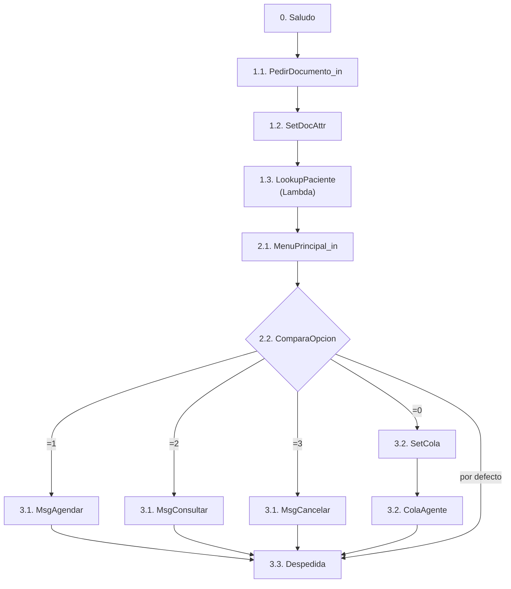

# Demo-CX: Amazon Connect + Serverless + CDK

> *Experiencia del cliente en agendamiento de citas médicas*

Demostracion de uso de **Amazon Connect** con componentes **Serverless** (como Lambdas) enfocado en experiencia del cliente (CX) para agendamiento de citas medicas.

## Arquitectura


## Flow `AgendamientoMedico` (`cdk/contact-flows/agendamiento-v1.json`)

```
0. Saludo (mensaje de bienvenida) → 1.1
1. Identificación del paciente
   1.1. PedirDocumento_in (DTMF, máx. 20) → 1.2
   1.2. SetDocAttr (documentId = $.StoredCustomerInput) → 1.3
   1.3. LookupPaciente (Lambda cx-patient-lookup) → 2.1
2. Menú principal
   2.1. MenuPrincipal_in (1/2/3/0) → 2.2
   2.2. ComparaOpcion ($.StoredCustomerInput)
        2.2.1. =1 → MsgAgendar → 3.3
        2.2.2. =2 → MsgConsultar → 3.3
        2.2.3. =3 → MsgCancelar → 3.3
        2.2.4. =0 → SetCola → ColaAgente → 3.3
        2.2.5. Por defecto → 3.3
3. Cierre
   3.1. Mensajes informativos (2.2.1–2.2.3)
   3.2. Transferencia a AgendamientoMedico (2.2.4)
   3.3. Despedida (desconecta; dispara el post-contacto)
```



## Estructura

```
  _____
./ cx /
├── cdk/                          # Infraestructura como código (CDK TypeScript)
│   ├── bin/connect.ts            # App telefonía: solo CxConnectStack (-c patientLookupArn)
│   ├── bin/serverless.ts         # App serverless: CxDataStack + CxComputeStack (default)
│   ├── lib/
│   │   ├── connect-stack.ts      # Telefonía: horario, cola, flow, routing
│   │   ├── data-stack.ts         # Datos: DynamoDB + S3 grabaciones
│   │   └── compute-stack.ts      # Cómputo: Lambdas + EventBridge + Bedrock
│   ├── contact-flows/            # Flows versionados (JSON exportado de consola)
│   │   └── agendamiento-v1.json
│   ├── test/cx.test.ts           # Tests de synth (sin VPC, sin acoples)
│   ├── cdk.json                  # App + feature flags (el CLI se ejecuta desde aquí)
│   └── cdk.out/                  # Output generado del synth (ignorado en git)
├── srv/                          # Componentes Serverless (srv): Código de funciones Lambda
│   ├── patient-lookup/index.ts   # Invocada desde el flow (lookup en DynamoDB)
│   └── post-contact/index.ts     # EventBridge → persiste interacción + resumen Bedrock
├── .github/workflows/            # CI/CD (OIDC, solo stacks serverless)
├── scripts/smoke.mjs             # Smoke test post-despliegue (Node nativo, contra AWS real)
├── package.json / tsconfig.json / jest.config.js   # Toolchain compartida (raíz)
└── README.md
```

## Separación Connect / Serverless

| App | Stacks | Despliegue |
|-----|--------|------------|
| Telefonía | `CxConnectStack` (instancia opcional, horario, cola, flow, routing) | `npm run deploy:connect` o con instancia existente: `npx cdk deploy CxConnectStack -c connectInstanceArn=arn:...` |
| Serverless | `CxDataStack` (DynamoDB + S3) + `CxComputeStack` (2 Lambdas + EventBridge + Bedrock) | `npm run deploy:serverless:dev` |

Los stacks serverless **no referencian** al stack Connect: el vínculo
flow ↔ Lambda se resuelve en synth sustituyendo `__PATIENT_LOOKUP_ARN__`
por el ARN pasado con `-c patientLookupArn=...`. Así el backend itera
sin tocar telefonía.

**Sin VPC por diseño.** DynamoDB, S3, Bedrock y EventBridge se consumen por
endpoints públicos con IAM de mínimo privilegio.

## Requisitos

Node >= 22, AWS CLI v2, `us-east-1`, créditos controlados (números locales).

## Uso local

```bash
npm ci
npm run build      # tsc --noEmit
npm test           # jest (synth de los 3 stacks)
npm run synth      # o synth:connect / synth:serverless
```

## Flujo de trabajo sugerido

1. Consola: reclamar número y crear usuario de prueba (la instancia `cx-medica`
   la crea el stack, o pasa la tuya con `-c connectInstanceArn=<arn>`).
2. `npm run deploy:serverless:dev` (serverless primero) y anota el ARN:
   `aws lambda get-function --function-name cx-patient-lookup --query Configuration.FunctionArn --output text`
3. `npm run deploy:connect -- -c patientLookupArn=<arn del paso 2>`
   (el flow se valida en la API: sin ARN real falla con InvalidContactFlowException).
4. Crear usuarios (admin + agente) y validar acceso en la `InstanceAccessUrl`:
   ```bash
   export INSTANCE_ID=$(aws cloudformation describe-stacks --stack-name CxConnectStack \
     --query "Stacks[0].Outputs[?OutputKey=='InstanceArn'].OutputValue" --output text | cut -d/ -f2)
   export ADMIN_PROFILE=$(aws connect list-security-profiles --instance-id $INSTANCE_ID \
     --query "SecurityProfileSummaryList[?Name=='Admin'].Id" --output text)
   export AGENT_PROFILE=$(aws connect list-security-profiles --instance-id $INSTANCE_ID \
     --query "SecurityProfileSummaryList[?Name=='Agent'].Id" --output text)
   export ROUTING_PROFILE=$(aws connect list-routing-profiles --instance-id $INSTANCE_ID \
     --query "RoutingProfileSummaryList[?starts_with(Name,'Agentes')].Id" --output text)
   aws connect create-user --instance-id $INSTANCE_ID --username admin \
     --password '<temporal>' --identity-info "FirstName=Cx,LastName=Admin,Email=<tu-email>" \
     --phone-config "PhoneType=SOFT_PHONE,AutoAccept=false,AfterContactWorkTimeLimit=0" \
     --security-profile-ids $ADMIN_PROFILE --routing-profile-id $ROUTING_PROFILE
   aws connect create-user --instance-id $INSTANCE_ID --username agente1 \
     --password '<temporal>' --identity-info "FirstName=Agente,LastName=Uno,Email=<tu-email>" \
     --phone-config "PhoneType=SOFT_PHONE,AutoAccept=false,AfterContactWorkTimeLimit=30" \
     --security-profile-ids $AGENT_PROFILE --routing-profile-id $ROUTING_PROFILE
   ```
   En web: consola Connect → *Users* → mismo resultado (perfil Agent + routing
   `AgentesAgendamiento`, softphone). El agente abre el CCP y se pone *Available*.
5. Llamada de prueba sin número reclamado (Connect llama a tu móvil por el flow):
   ```bash
   export FLOW_ID=$(aws connect list-contact-flows --instance-id $INSTANCE_ID \
     --query "ContactFlowSummaryList[?Name=='AgendamientoMedico'].Id" --output text)
   export QUEUE_ID=$(aws cloudformation describe-stacks --stack-name CxConnectStack \
     --query "Stacks[0].Outputs[?OutputKey=='QueueArn'].OutputValue" --output text | awk -F/ '{print $NF}')
   aws connect start-outbound-voice-contact --instance-id $INSTANCE_ID \
     --contact-flow-id $FLOW_ID --queue-id $QUEUE_ID \
     --destination-phone-number '+34TU_MOVIL'
   ```
   Marca 1/2/3 (mensajes → cuelga); el 0 transfiere a la cola (requiere agente
   *Available*). Verificación: ítem `INTERACTION#<contactId>` en DynamoDB +
   logs de las Lambdas en CloudWatch.

## Despliegue continuo (GitHub Actions + OIDC)

El workflow [`.github/workflows/deploy.yml`](.github/workflows/deploy.yml) despliega
solo los stacks serverless (`CxDataStack` + `CxComputeStack`) en cada push a `main`,
asumiendo un rol IAM vía OIDC (sin claves de acceso largas). Configuración inicial
con AWS CLI (una vez por cuenta):

```bash
export AWS_REGION=us-east-1
export ACCOUNT_ID=$(aws sts get-caller-identity --query Account --output text)

# 1. Proveedor OIDC (una vez por cuenta)
aws iam create-open-id-connect-provider \
  --url https://token.actions.githubusercontent.com \
  --client-id-list sts.amazonaws.com \
  --thumbprint-list 6938fd4d98bab03faadb97b34396831e3780aea1

# 2. IDs del repo (el `sub` OIDC exige formato inmutable con IDs)
curl -s https://api.github.com/repos/kaesar/demo-cx | jq '{owner_id: .owner.id, repository_id: .id}'
export OWNER_ID=$(curl -s https://api.github.com/repos/kaesar/demo-cx | jq -r .owner.id)
export REPOSITORY_ID=$(curl -s https://api.github.com/repos/kaesar/demo-cx | jq -r .id)

# 3. Trust policy (acepta `sub` clásico e inmutable)
jq -n \
  --arg account "$ACCOUNT_ID" \
  --arg sub_classic "repo:kaesar/demo-cx:*" \
  --arg sub_immutable "repo:kaesar@$OWNER_ID/demo-cx@$REPOSITORY_ID:*" \
  '{
    Version: "2012-10-17",
    Statement: [{
      Effect: "Allow",
      Principal: {Federated: "arn:aws:iam::\($account):oidc-provider/token.actions.githubusercontent.com"},
      Action: "sts:AssumeRoleWithWebIdentity",
      Condition: {
        StringEquals: {"token.actions.githubusercontent.com:aud": "sts.amazonaws.com"},
        StringLike: {"token.actions.githubusercontent.com:sub": [$sub_classic, $sub_immutable]}
      }
    }]
  }' > trust.json

aws iam create-role --role-name role-github \
  --assume-role-policy-document file://trust.json \
  --description "Deploy CDK demo-cx desde GitHub Actions via OIDC"

# 3. Permisos (mínimo privilegio: asume los roles del bootstrap).
jq -n --arg account "$ACCOUNT_ID" \
  '{"Version":"2012-10-17","Statement":[{"Effect":"Allow", "Action":["sts:AssumeRole","iam:PassRole"],"Resource":"arn:aws:iam::\($account):role/cdk-hnb659fds-*-\($account)-*"}]}' > inline-policy.json

aws iam put-role-policy --role-name role-github \
  --policy-name cdk-deploy --policy-document file://inline-policy.json

# 4. Bootstrap + secret con el ARN del rol
npx cdk bootstrap aws://$ACCOUNT_ID/us-east-1
```

> Para secretos puedes usar: `gh secret set AWS_DEPLOY_ROLE_ARN --body "arn:aws:iam::$ACCOUNT_ID:role/role-github"`  
> El stack Connect **no** se despliega en este pipeline: la telefonía se gestiona aparte con `npm run deploy:connect -- -c patientLookupArn=<arn>`.
