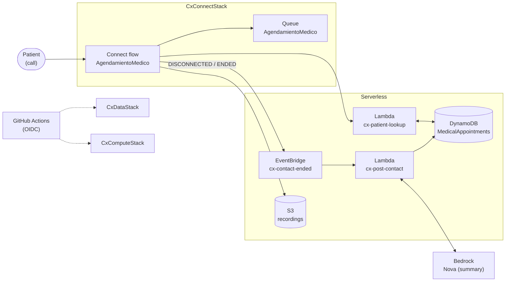
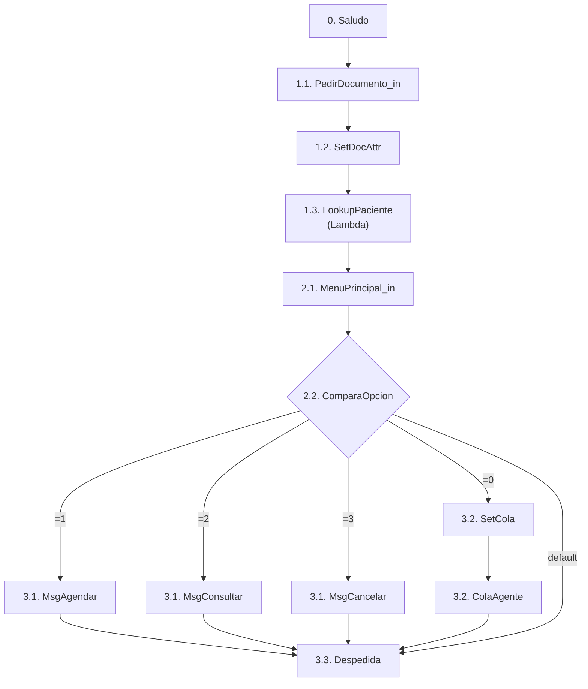

# Demo-CX: Amazon Connect + Serverless + CDK

> *Customer experience for medical appointment scheduling*

Demo of **Amazon Connect** with **Serverless** components (such as Lambdas) focused on customer experience (CX) for medical appointment scheduling.

## Architecture



## `AgendamientoMedico` flow (`cdk/contact-flows/agendamiento-v1.json`)

```
0. Saludo (welcome message) → 1.1
1. Patient identification
   1.1. PedirDocumento_in (DTMF, max 20) → 1.2
   1.2. SetDocAttr (documentId = $.StoredCustomerInput) → 1.3
   1.3. LookupPaciente (cx-patient-lookup Lambda) → 2.1
2. Main menu
   2.1. MenuPrincipal_in (1/2/3/0) → 2.2
   2.2. ComparaOpcion ($.StoredCustomerInput)
        2.2.1. =1 → MsgAgendar → 3.3
        2.2.2. =2 → MsgConsultar → 3.3
        2.2.3. =3 → MsgCancelar → 3.3
        2.2.4. =0 → SetCola → ColaAgente → 3.3
        2.2.5. Default → 3.3
3. Closing
   3.1. Informational messages (2.2.1–2.2.3)
   3.2. Transfer to AgendamientoMedico (2.2.4)
   3.3. Despedida (disconnects; triggers post-contact)
```



## Structure

```
  _____
./ cx /
├── cdk/                          # Infrastructure as code (TypeScript CDK)
│   ├── bin/connect.ts            # Telephony app: CxConnectStack only (-c patientLookupArn)
│   ├── bin/serverless.ts         # Serverless app: CxDataStack + CxComputeStack (default)
│   ├── lib/
│   │   ├── connect-stack.ts      # Telephony: hours, queue, flow, routing
│   │   ├── data-stack.ts         # Data: DynamoDB + S3 recordings
│   │   └── compute-stack.ts      # Compute: Lambdas + EventBridge + Bedrock
│   ├── contact-flows/            # Versioned flows (console-exported JSON)
│   │   └── agendamiento-v1.json
│   ├── test/cx.test.ts           # Synth tests (no VPC, no coupling)
│   ├── cdk.json                  # App + feature flags (CLI runs from here)
│   └── cdk.out/                  # Generated synth output (git-ignored)
├── srv/                          # Serverless components (srv): Lambda function code
│   ├── patient-lookup/index.ts   # Invoked from the flow (DynamoDB lookup)
│   └── post-contact/index.ts     # EventBridge → persists interaction + Bedrock summary
├── .github/workflows/            # CI/CD (OIDC, serverless stacks only)
├── scripts/smoke.mjs             # Post-deploy smoke test (native Node, against real AWS)
├── package.json / tsconfig.json / jest.config.js   # Shared toolchain (root)
└── README.md
```

## Connect / Serverless separation

| App | Stacks | Deploy |
|-----|--------|------------|
| Telephony | `CxConnectStack` (optional instance, hours, queue, flow, routing) | `npm run deploy:connect` or with an existing instance: `npx cdk deploy CxConnectStack -c connectInstanceArn=arn:...` |
| Serverless | `CxDataStack` (DynamoDB + S3) + `CxComputeStack` (2 Lambdas + EventBridge + Bedrock) | `npm run deploy:serverless:dev` |

The serverless stacks do **not reference** the Connect stack: the flow ↔ Lambda
link is resolved at synth by substituting `__PATIENT_LOOKUP_ARN__`
with the ARN passed via `-c patientLookupArn=...`. This way the backend iterates
without touching telephony.

**No VPC by design.** DynamoDB, S3, Bedrock and EventBridge are consumed over
public endpoints with least-privilege IAM.

## Requirements

Node >= 22, AWS CLI v2, `us-east-1`, controlled credits (local numbers).

## Local usage

```bash
npm ci
npm run build      # tsc --noEmit
npm test           # jest (synth of the 3 stacks)
npm run synth      # or synth:connect / synth:serverless
```

## Suggested workflow

1. Console: claim a number and create a test user (the `cx-medica` instance
   is created by the stack, or pass your own with `-c connectInstanceArn=<arn>`).
2. `npm run deploy:serverless:dev` (serverless first) and note the ARN:
   `aws lambda get-function --function-name cx-patient-lookup --query Configuration.FunctionArn --output text`
3. `npm run deploy:connect -- -c patientLookupArn=<arn from step 2>`
   (the flow is validated by the API: no real ARN fails with InvalidContactFlowException).
4. Create users (admin + agent) and validate access at the stack's `InstanceAccessUrl`:
   ```bash
   export INSTANCE_ID=$(aws cloudformation describe-stacks --stack-name CxConnectStack \
     --query "Stacks[0].Outputs[?OutputKey=='InstanceArn'].OutputValue" --output text | cut -d/ -f2)
   export ADMIN_PROFILE=$(aws connect list-security-profiles --instance-id $INSTANCE_ID \
     --query "SecurityProfileSummaryList[?Name=='Admin'].Id" --output text)
   export AGENT_PROFILE=$(aws connect list-security-profiles --instance-id $INSTANCE_ID \
     --query "SecurityProfileSummaryList[?Name=='Agent'].Id" --output text)
   export ROUTING_PROFILE=$(aws connect list-routing-profiles --instance-id $INSTANCE_ID \
     --query "RoutingProfileSummaryList[?starts_with(Name,'Agentes')].Id" --output text)
   aws connect create-user --instance-id $INSTANCE_ID --username admin \
     --password '<temporary>' --identity-info "FirstName=Cx,LastName=Admin,Email=<your-email>" \
     --phone-config "PhoneType=SOFT_PHONE,AutoAccept=false,AfterContactWorkTimeLimit=0" \
     --security-profile-ids $ADMIN_PROFILE --routing-profile-id $ROUTING_PROFILE
   aws connect create-user --instance-id $INSTANCE_ID --username agente1 \
      --password '<temporary>' --identity-info "FirstName=Sam,LastName=Agent,Email=<your-email>" \
     --phone-config "PhoneType=SOFT_PHONE,AutoAccept=false,AfterContactWorkTimeLimit=30" \
     --security-profile-ids $AGENT_PROFILE --routing-profile-id $ROUTING_PROFILE
   ```
   On the web: Connect console → *Users* → same result (Agent profile + `AgentesAgendamiento`
   routing, softphone). The agent opens the CCP and goes *Available*.
5. Test call with no claimed number (Connect calls your mobile through the flow):
   ```bash
   export FLOW_ID=$(aws connect list-contact-flows --instance-id $INSTANCE_ID \
     --query "ContactFlowSummaryList[?Name=='AgendamientoMedico'].Id" --output text)
   export QUEUE_ID=$(aws cloudformation describe-stacks --stack-name CxConnectStack \
     --query "Stacks[0].Outputs[?OutputKey=='QueueArn'].OutputValue" --output text | awk -F/ '{print $NF}')
   aws connect start-outbound-voice-contact --instance-id $INSTANCE_ID \
     --contact-flow-id $FLOW_ID --queue-id $QUEUE_ID \
     --destination-phone-number '+34YOUR_MOBILE'
   ```
   Press 1/2/3 (messages → hangs up); 0 transfers to the queue (requires an
   *Available* agent). Verification: `INTERACTION#<contactId>` item in DynamoDB +
   Lambda logs in CloudWatch.

## Continuous deployment (GitHub Actions + OIDC)

The [`.github/workflows/deploy.yml`](.github/workflows/deploy.yml) workflow deploys
only the serverless stacks (`CxDataStack` + `CxComputeStack`) on every push to `main`,
assuming an IAM role via OIDC (no long-lived keys). Initial setup
with AWS CLI (once per account):

```bash
export AWS_REGION=us-east-1
export ACCOUNT_ID=$(aws sts get-caller-identity --query Account --output text)

# 1. OIDC provider (once per account)
aws iam create-open-id-connect-provider \
  --url https://token.actions.githubusercontent.com \
  --client-id-list sts.amazonaws.com \
  --thumbprint-list 6938fd4d98bab03faadb97b34396831e3780aea1

# 2. Repo IDs (OIDC `sub` requires the immutable format with IDs)
curl -s https://api.github.com/repos/kaesar/demo-cx | jq '{owner_id: .owner.id, repository_id: .id}'
export OWNER_ID=$(curl -s https://api.github.com/repos/kaesar/demo-cx | jq -r .owner.id)
export REPOSITORY_ID=$(curl -s https://api.github.com/repos/kaesar/demo-cx | jq -r .id)

# 3. Trust policy (accepts classic and immutable `sub`)
jq -n \
  --arg account "$ACCOUNT_ID" \
  --arg sub_classic "repo:kaesar/demo-cx:*" \
  --arg sub_immutable "repo:kaesar@$OWNER_ID/demo-cx@$REPOSITORY_ID:*" \
  '{
    Version: "2012-10-17",
    Statement: [{
      Effect: "Allow",
      Principal: {Federated: "arn:aws:iam::\($account):oidc-provider/token.actions.githubusercontent.com"},
      Action: "sts:AssumeRoleWithWebIdentity",
      Condition: {
        StringEquals: {"token.actions.githubusercontent.com:aud": "sts.amazonaws.com"},
        StringLike: {"token.actions.githubusercontent.com:sub": [$sub_classic, $sub_immutable]}
      }
    }]
  }' > trust.json

aws iam create-role --role-name role-github \
  --assume-role-policy-document file://trust.json \
  --description "Deploy CDK demo-cx from GitHub Actions via OIDC"

# 3. Permissions (least privilege: assumes the bootstrap roles).
jq -n --arg account "$ACCOUNT_ID" \
  '{"Version":"2012-10-17","Statement":[{"Effect":"Allow", "Action":["sts:AssumeRole","iam:PassRole"],"Resource":"arn:aws:iam::\($account):role/cdk-hnb659fds-*-\($account)-*"}]}' > inline-policy.json

aws iam put-role-policy --role-name role-github \
  --policy-name cdk-deploy --policy-document file://inline-policy.json

# 4. Bootstrap + secret with the role ARN
npx cdk bootstrap aws://$ACCOUNT_ID/us-east-1
```

> For secrets you can use: `gh secret set AWS_DEPLOY_ROLE_ARN --body "arn:aws:iam::$ACCOUNT_ID:role/role-github"`  
> The Connect stack is **not** deployed by this pipeline: telephony is managed separately with `npm run deploy:connect -- -c patientLookupArn=<arn>`.
